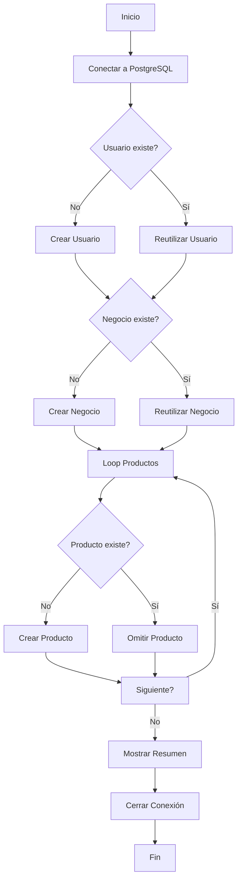

# ✅ Script de Seed Completado

## 📦 Archivos Creados

### 1. `src/seed.ts` (Archivo Principal)
Script ejecutable con ts-node que:
- ✅ Conecta a PostgreSQL usando TypeORM DataSource
- ✅ Crea usuario empresa con bcrypt
- ✅ Crea negocio de ejemplo
- ✅ Crea 3 productos de ejemplo
- ✅ Verifica duplicados (idempotente)
- ✅ Muestra progreso detallado

### 2. `SEED_README.md` (Guía Rápida)
Quick start con:
- ✅ Instrucciones de uso
- ✅ Credenciales de prueba
- ✅ Troubleshooting común
- ✅ Ejemplos de testing

### 3. `SEED_DOCUMENTATION.md` (Documentación Completa)
Documentación exhaustiva con:
- ✅ Descripción detallada
- ✅ Todos los datos insertados
- ✅ Configuración y requisitos
- ✅ Personalización
- ✅ Ejemplos de código

### 4. `package.json` (Actualizado)
Script añadido:
```json
"seed": "ts-node -r tsconfig-paths/register src/seed.ts"
```

---

## 🎯 Datos Insertados

### 👤 Usuario Empresa
```javascript
{
  email: "empresa@seed.com",
  password: "Empresa123!",  // Hasheado con bcrypt
  name: "Restaurante La Casa del Sabor",
  type: "empresa",
  phone: "+1234567890"
}
```

### 🏢 Negocio
```javascript
{
  name: "Pizzería Bella Italia",
  description: "Las mejores pizzas artesanales de la ciudad...",
  address: "Av. Principal 123, Centro Histórico",
  whatsappNumber: "+1234567890",
  openingHours: {
    lunes: { open: "12:00", close: "23:00" },
    martes: { open: "12:00", close: "23:00" },
    // ... todos los días
  }
}
```

### 🍕 Productos

| Producto | Precio | Peso | Imagen |
|----------|--------|------|--------|
| Pizza Margherita | $12.99 | 450g | ✅ Unsplash |
| Pizza Pepperoni | $14.99 | 500g | ✅ Unsplash |
| Pizza Cuatro Quesos | $16.99 | 480g | ✅ Unsplash |

---

## 🚀 Uso

```bash
# Ejecutar el seed
pnpm seed

# Output esperado:
🌱 Iniciando seed de la base de datos...
📡 Conectando a la base de datos...
✅ Conexión establecida
👤 Creando usuario empresa...
✅ Usuario empresa creado
🏢 Creando negocio...
✅ Negocio creado
🍕 Creando productos...
✅ "Pizza Margherita" creado - $12.99
✅ "Pizza Pepperoni" creado - $14.99
✅ "Pizza Cuatro Quesos" creado - $16.99
✅ SEED COMPLETADO CON ÉXITO
```

---

## 🔑 Credenciales de Prueba

**Login:**
```bash
POST http://localhost:3000/api/auth/login

{
  "email": "empresa@seed.com",
  "password": "Empresa123!"
}
```

**Token:** Usar el `access_token` retornado para endpoints protegidos

---

## 📝 Características del Script

### ✅ Idempotente
- Verifica si los datos ya existen
- No duplica información
- Reutiliza datos existentes
- Muestra advertencias claras

### ✅ TypeORM DataSource
```typescript
const AppDataSource = new DataSource({
  type: 'postgres',
  host: process.env.DB_HOST || 'localhost',
  entities: [User, Business, Product, Reaction],
  synchronize: true,
});

await AppDataSource.initialize();
const userRepository = AppDataSource.getRepository(User);
await userRepository.save(user);
```

### ✅ Bcrypt para Passwords
```typescript
const passwordHash = await bcrypt.hash('Empresa123!', 10);
user.passwordHash = passwordHash;
```

### ✅ Repository.save()
```typescript
// Crear entidad
const user = userRepository.create({ ... });

// Guardar en base de datos
const savedUser = await userRepository.save(user);
```

### ✅ Manejo de Errores
```typescript
try {
  await AppDataSource.initialize();
  // ... seed logic
} catch (error) {
  console.error('❌ Error:', error);
  process.exit(1);
} finally {
  await AppDataSource.destroy();
}
```

---

## 🧪 Testing

### 1. Verificar Usuario Creado
```bash
# Login
curl -X POST http://localhost:3000/api/auth/login \
  -H "Content-Type: application/json" \
  -d '{
    "email": "empresa@seed.com",
    "password": "Empresa123!"
  }'

# Respuesta esperada:
{
  "access_token": "eyJhbGciOiJIUzI1NiIsInR5cCI6IkpXVCJ9...",
  "user": {
    "id": "...",
    "email": "empresa@seed.com",
    "type": "empresa"
  }
}
```

### 2. Verificar Negocio Creado
```bash
# Listar negocios
curl http://localhost:3000/api/businesses

# Respuesta esperada:
[
  {
    "id": "...",
    "name": "Pizzería Bella Italia",
    "description": "Las mejores pizzas artesanales...",
    "address": "Av. Principal 123, Centro Histórico"
  }
]
```

### 3. Verificar Productos Creados
```bash
# Listar productos
curl http://localhost:3000/api/products

# Respuesta esperada:
[
  {
    "id": "...",
    "name": "Pizza Margherita",
    "price": 12.99,
    "isAvailable": true
  },
  {
    "id": "...",
    "name": "Pizza Pepperoni",
    "price": 14.99,
    "isAvailable": true
  },
  {
    "id": "...",
    "name": "Pizza Cuatro Quesos",
    "price": 16.99,
    "isAvailable": true
  }
]
```

---

## 🛠️ Requisitos Previos

### ✅ PostgreSQL Instalado y Corriendo
```bash
# Verificar status
sudo systemctl status postgresql

# Iniciar si no está corriendo
sudo systemctl start postgresql
```

### ✅ Base de Datos Creada
```bash
# Crear base de datos
psql -U postgres -c "CREATE DATABASE delivery_db;"

# Verificar que existe
psql -U postgres -l | grep delivery_db
```

### ✅ Variables de Entorno (.env)
```bash
DB_HOST=localhost
DB_PORT=5432
DB_USER=postgres
DB_PASS=postgres
DB_NAME=delivery_db
```

### ✅ Dependencias Instaladas
```bash
# Instalar si es necesario
pnpm install
```

---

## 📊 Estructura del Script

```
src/seed.ts
│
├── Imports
│   ├── reflect-metadata
│   ├── TypeORM DataSource
│   ├── bcrypt
│   └── Entidades (User, Business, Product)
│
├── DataSource Configuration
│   ├── PostgreSQL connection
│   ├── Entities loading
│   └── synchronize: true
│
├── seed() Function
│   ├── 1. Initialize Connection
│   ├── 2. Get Repositories
│   ├── 3. Create User (with bcrypt)
│   ├── 4. Create Business
│   ├── 5. Create Products (loop)
│   ├── 6. Show Summary
│   └── 7. Close Connection
│
└── Error Handling
    ├── try/catch block
    ├── finally for cleanup
    └── process.exit(1) on error
```

---

## 🔄 Flujo de Ejecución



---

## ✅ Checklist de Implementación

- [x] Script `src/seed.ts` creado
- [x] TypeORM DataSource configurado
- [x] AppDataSource.initialize() implementado
- [x] Repository.save() para todas las entidades
- [x] Usuario empresa con bcrypt
- [x] Negocio con horarios
- [x] 3 productos con datos reales
- [x] Verificación de duplicados
- [x] Logs detallados con emojis
- [x] Manejo de errores robusto
- [x] Script añadido a package.json
- [x] Ejecutable con `ts-node src/seed.ts`
- [x] Ejecutable con `pnpm seed`
- [x] Documentación completa
- [x] README rápido
- [x] Troubleshooting guide

---

## 🎨 Personalización

### Cambiar Usuario
```typescript
// En src/seed.ts, línea ~50
empresaUser = userRepository.create({
  type: UserType.EMPRESA,
  name: 'Tu Negocio',        // Cambiar aquí
  email: 'tu@email.com',     // Cambiar aquí
  phone: '+1234567890',
  passwordHash,              // Cambiar password en línea ~47
});
```

### Cambiar Negocio
```typescript
// En src/seed.ts, línea ~95
business = businessRepository.create({
  name: 'Tu Pizzería',              // Cambiar aquí
  description: 'Tu descripción',     // Cambiar aquí
  address: 'Tu dirección',           // Cambiar aquí
  // ...
});
```

### Añadir Productos
```typescript
// En src/seed.ts, línea ~120
const products = [
  // ... productos existentes
  {
    name: 'Tu Producto',
    description: 'Descripción',
    price: 19.99,
    weightGrams: 600,
    // ...
  },
];
```

---

## 📚 Referencias

- **TypeORM DataSource**: https://typeorm.io/data-source
- **TypeORM Repository**: https://typeorm.io/repository-api
- **bcrypt**: https://www.npmjs.com/package/bcrypt
- **ts-node**: https://typestrong.org/ts-node/

---

## 🎯 Próximos Pasos

1. ✅ Ejecutar el seed: `pnpm seed`
2. ✅ Iniciar el servidor: `pnpm start:dev`
3. ✅ Hacer login con las credenciales
4. ✅ Explorar los endpoints
5. ✅ Crear un cliente de prueba
6. ✅ Probar reacciones a productos

---

**Fecha:** 31 de octubre de 2025  
**Estado:** ✅ Completado y Documentado  
**Comando:** `pnpm seed` o `ts-node src/seed.ts`  
**Archivos:** 4 (seed.ts + 3 documentos)
